# Método Hierárquico Aglomerativo

O primeiro passo é a análise das variáveis para avaliação da padronização das variáveis por zscore (média 0 e desvio padrão 1)

# Medidas de Dissimilaridade
- Identifica a Distância entre as observações.

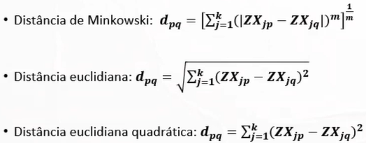
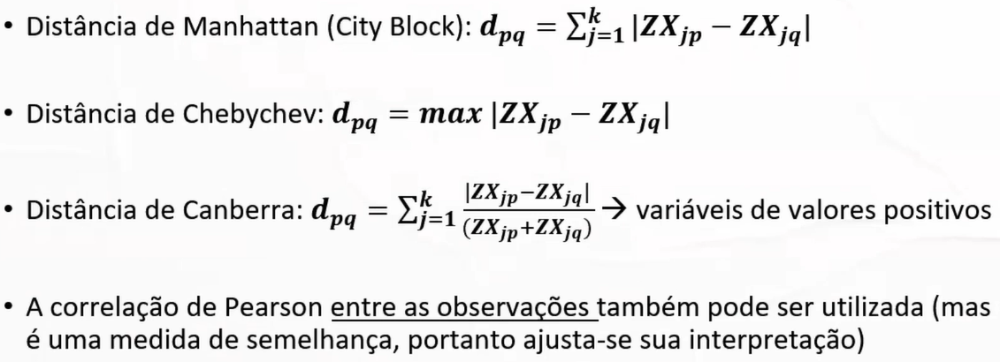

**Tabela de exemplo:**

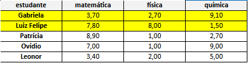

**Cálculos:**

``Distância Euclidiana Quadrática e Euclidiana:``

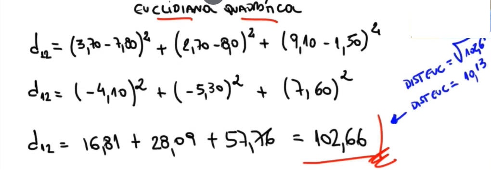

``Distância de Manhattan (City Block):``

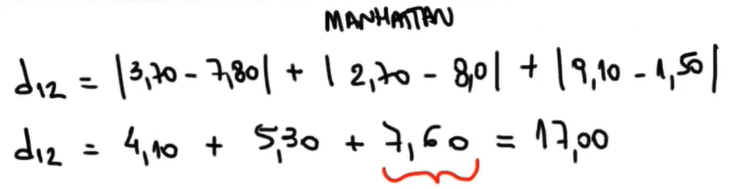
*``Distância de Chebychev`` é a maior distância entre as distâncias determinadas pelo cálculo de Manhattan (valor grifado em vermelho no exemplo 7,6).*

*``Distância de Camberra:`` o valor desta distância sempre será maior que zero e menor que a quantidade de variáveis do dataset (3 nesse exemplo).*

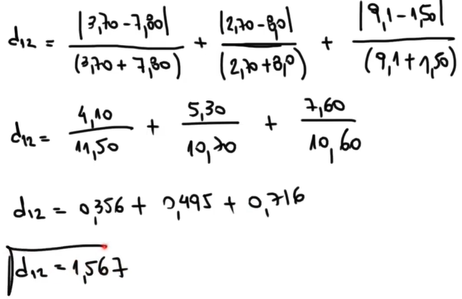

*``Correlação de Pearson`` tem uma particularidade perante as outras, esta medida se trata de uma medida de similaridade, ao contrário das outras*

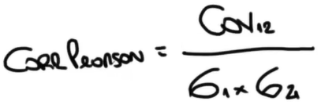

# Métodos de Encadeamento
- É o método de referência para as medidas de distância, que irá nortear a formação dos clusters, ou seja, na prática ele irá determinar a distância entre os clusters.

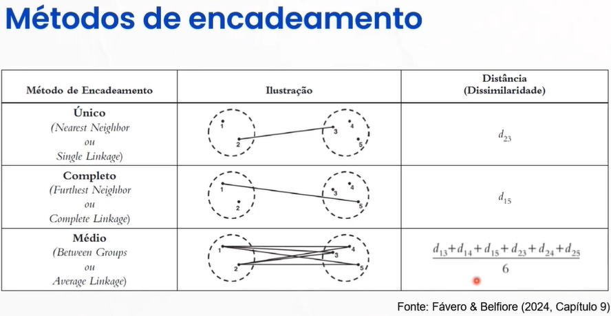
- ``Nearst Neighbor (Single Linkage)`` privilegia menores distâncias, recomendável em casos de observações distintas.
- ``Furthest Neighbor (Complete Linkage)`` privilegia maiores distâncias, recomendável em casos de observações parecidas.
- ``Between Groups (Average Linkage)`` junção de grupos pela distância média entre todos os pares de observações dos grupos em análise.

# Esquemas de Aglomeração
- ``Hierárquico Aglomerativo``: Começa com todas as observações separadas e vai agrupando todas em clusters de acordo com a distância entre elas até que exista somente um cluster (juntando todas em um único cluster).

*Exemplo de como funciona aglomeração com single linkage:*
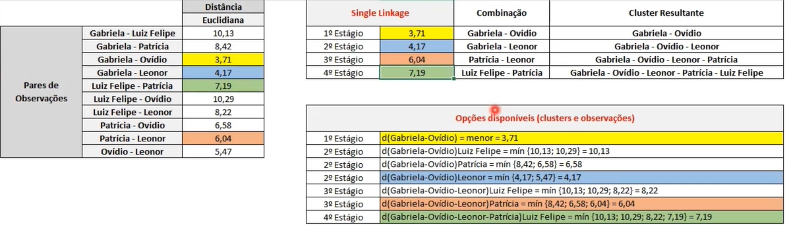

*Exemplo de como funciona aglomeração com complete linkage:*
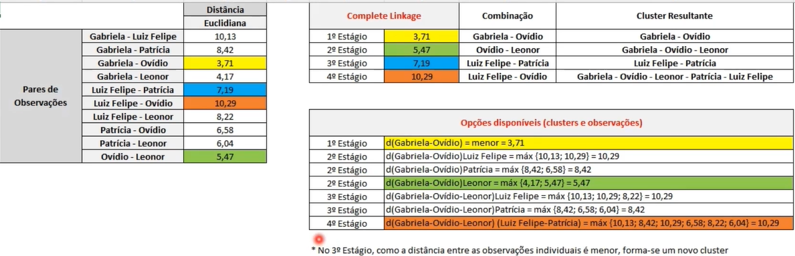

*Exemplo de como funciona aglomeração com o avarage linkage:*
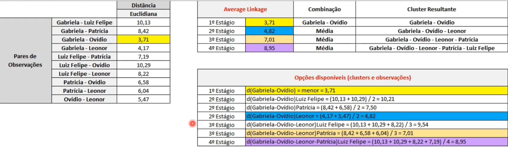

## Análise dos agrupamentos

- Avaliar quais variáveis foram relevantes para formação dos clusters;
- Após a clusterização, analisar se a variabilidade dentro do grupo é menor do que a variabilidade entre os grupos levando em conta as variáveis utilizadas;
- Analisar a variância através do teste F. F = Variabilidade entre Grupos / Variabilidade dentro dos Grupos

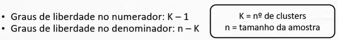

- É possível analisar quais variáveis mais contribuíram para a formação de pelo menos umdosclusters: maiores valores da estatística F (em conjunto com a significância).

# Método Não Hierárquico K-Means

Assim como no método hierárquico, o primeiro passo é analisar os dados para avaliar a necessidade de padronização dos dados por zscore (média 0 e desvio padrão 1), para que os dados fiquem mais concentrados.

No método não hierárquico a quantidade de Clusters é definida já no inicio do processo, motivo pelo qual se usa o Elbow Method ou até mesmo utilizar o método hierárquico num primeiro momento para definir a quantidade de clusters ideal e partir desta pré análise para definir o número de clusters.

Nas etapas seguintes, as observações vão sendo comparadas pela proximidade aos centroides dos outros clusters. Se houver realocação a outro cluster por estar mais próxima, os centroides são recalculados (em ambos os clusters).

*Trata-se de um processo Iterativo*

O procedimento K-means encerra-se quando não for possível realocar qualquer observação por estar mais próxima do centroide de outro cluster: indica que a soma dos quadrados de cada observação até o centro do cluster (o mi "u" na fórmula) alocada foi minimizada.

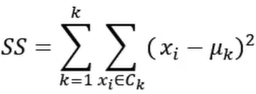

**Identificação da quantidade de clusters**

*``Método Elbow`` para identificação do nº de clusters*
- Elaborado com base na *``WCSS (Within-Cluster Sum of Squares)``*: distância de cada observação para o centroide de seu cluster
- Quanto mais próximos entre si e do centroide, menores as distâncias internas
- Normalmente, busca-se o "cotovelo", ou seja, o ponto onde a curva "dobra"

*``Método da Silhueta`` para identificação do nº de clusters*
- b = A distância média entre a observação e as observações do cluster mais próximo do qual este ponto não está alocado.
- a = A distância média das observações dentro do cluster

Por fim, calcula-se o coeficiente médio da silhueta para todas as observações. O procedimento é realizado para vários números de k diferentes, similar ao que se faz no método de elbow, para encontrar o número de clusters ideal.
